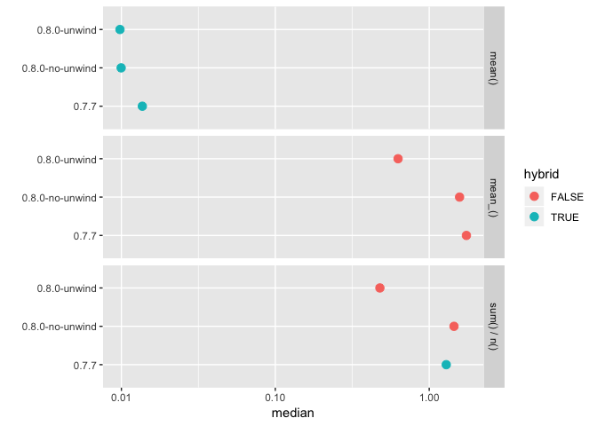

<!-- README.md is generated from README.Rmd. Please edit that file -->

# dplyrbench

``` r
dplyrbench::setup_libs()
```

``` r
library(dplyrbench)
library(dplyr)
#> 
#> Attaching package: 'dplyr'
#> The following objects are masked from 'package:stats':
#> 
#>     filter, lag
#> The following objects are masked from 'package:base':
#> 
#>     intersect, setdiff, setequal, union
library(ggplot2)

# non hybrid
no_hybrid <- benchs({
    mean_ <- function(...) mean(...)
    df <- tibble(x = rnorm(1e6), g = rep(1:1e5, 10)) %>% group_by(g)
  }, 
  summarise(df, x = mean_(x))
) %>% mutate(hybrid = FALSE, expression = "mean_()")

# hybrid
hybrid <- benchs(
  df <- tibble(x = rnorm(1e6), g = rep(1:1e5, 10)) %>% group_by(g),
  summarise(df, x = mean(x))
) %>% mutate(hybrid = TRUE,  expression = "mean()")

# partial hybrid
partial_hybrid <- benchs(
  df <- tibble(x = rnorm(1e6), g = rep(1:1e5, 10)) %>% group_by(g),
  summarise(df, x = sum(x) / n())
) %>% mutate(hybrid = c(TRUE, FALSE, FALSE),  expression = "sum() / n()")

data <- bind_rows(hybrid, no_hybrid, partial_hybrid) %>% 
  select(version, unwind, hybrid, expression, min:mem_alloc)

ggplot(data, aes(y = version, x = median, col = hybrid)) + 
  geom_point(size = 3) + 
  facet_grid(factor(expression, levels = c("mean()", "mean_()", "sum() / n()"))~.) +
  scale_x_log10() + 
  ylab("") 
```


